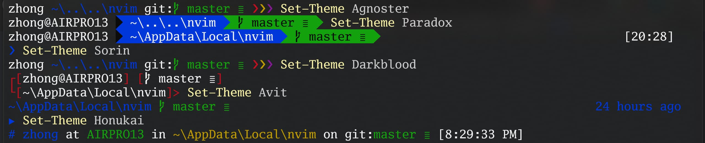
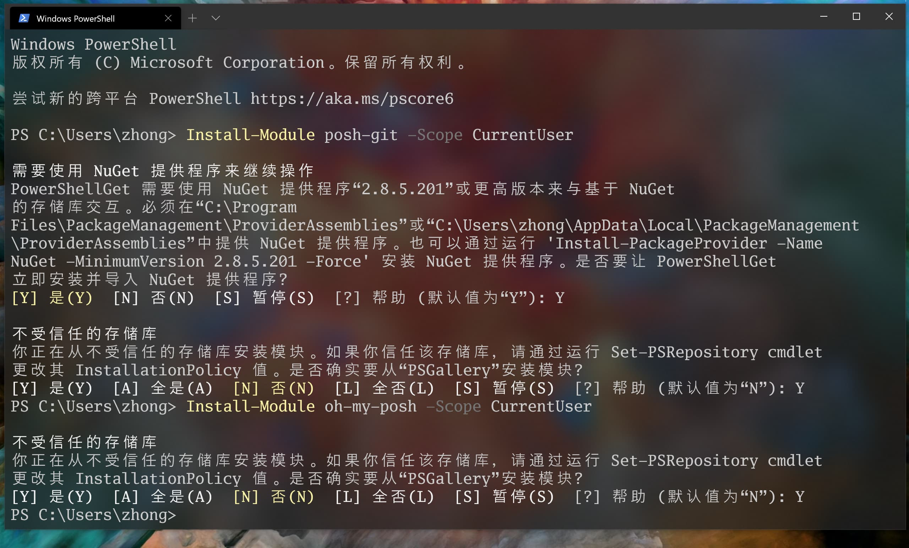

# Windows-Terminal + Powershell + Powerline 配置方案
  用过 Linux 或 Unix（比如 Mac) 的同学肯定被它们炫酷的终端和优雅的包管理方式所吸引ヾ (•ω•`)o`，
但身为一名普通学生却只能继续爱着 Windows。

  随着 Microsoft 正式版的 Windows-Terminal 和预览版的 Winget 的发布，
对于对 win 终端，我又折腾了一下。

  以下是过程... ...



建议了解以下内容：
* [PowerShell](https://docs.microsoft.com/zh-cn/powershell/scripting/overview?view=powershell-7)
* [Windows-Terminal](https://aka.ms/terminal-documentation)
* [oh-my-posh](https://github.com/JanDeDobbeleer/oh-my-posh)

## 简单的配置
Option: 本仓库"PowerShell.exe"提供了一些 powershll 一些配色，如果你不打算安装 Windows-Terminal ,可以试着配置下简单的Powershell

1. 在 Microsoft store 中搜索并安装 Windows Terminal
2. 打开本仓库"Windows Terminal"文件夹，将'settings.json'内容复制（大部分注释替换成了中文）
3. 打开 windows Terminal, 按"Ctrl+,", 用复制的内容替换打开的内容
* 完成后你会得到如下效果：
<div>
    
</div>

1. {W 警告}: 此'settings.json'适用于`16:10`的屏幕显示，更具情况适当修改显示大小。
2. {X 错误}: 你可能会遇到缺失字体，你可从 [Font](###Font) 中找到，或者修改你电脑上有的字体。

## 完整配置
### Font
  好的字体使终端更具可玩性，你可从本仓库"fonts"文件中安装所需的字体，也可从以下网址下载:

* 微软官方推荐字体
  - [cascadia-code](https://docs.microsoft.com/zh-cn/windows/terminal/cascadia-code)

* 个人推荐字体
  - [sarasa 更纱黑体](https://github.com/be5invis/Sarasa-Gothic/releases)
  - [powerline 字体](https://github.com/powerline/fonts)
  - [nerd-fonts](https://github.com/ryanoasis/nerd-fonts)

### Prerequisites
1. 安装适合 Powershell 的 [Posh-Git](https://github.com/dahlbyk/posh-git)插件和[Oh-My-Posh](https://github.com/JanDeDobbeleer/oh-my-posh)
主题
```shell
Install-Module posh-git -Scope CurrentUser
Install-Module oh-my-posh -Scope CurrentUser

# 以上两个插件安装目录如下：
# C:\Users\<UserName>\OneDrive\文档\WindowsPowerShell\Modules\
```
 * 如果使用的是 PowerShell Core，请安装 PSReadline：
  ```shell
  Install-Module -Name PSReadLine -AllowPrerelease -Scope CurrentUser -Force -SkipPublisherCheck
  ```


2. 安装ConEmu
```shell
choco install ConEmu
```

* chocolatey 是一个Windows包管理器
  - [choco 官网](https://chocolatey.org/install)
* 如果没有choco可以手动安装[ConEmu](https://conemu.github.io/)(建议安装Choco)
* 手动安装choco,步骤如下(或者运行本仓库'Non-Administrative Installation'的"ChocolateyInstallNonAdmin.ps1."):
  > ### If you no **choco**,you can read **next steps**.
  > ==== Non-Administrative Installation.(非管理员模式下安装)
  > * 将以下脚本另存为： **ChocolateyInstallNonAdmin.ps1.**
  > * 使用下面的脚本，确定是否要安装'Chocolatey',默认安装位置： **C:\ProgramData\chocoportable**.(按需修改)
  > * 打开 PowerShell.exe.
  > * 运行 `Set-ExecutionPolicy Bypass -Scope Process -Force;`.(修改Windows 的执行策略，下面有补充说明！)
  > * 到保存 `.\ChocolateyInstallNonAdmin.ps1`为文件目录下运行该文件(或者双击运行)
  >
  > ==== ChocolateyInstallNonAdmin.ps1:
  > ```ps1
  > # Set directory for installation - Chocolatey does not lock(解锁文件)
  > # 安装目录
  > $InstallDir='C:\ProgramData\chocoportable'
  > $env:ChocolateyInstall="$InstallDir"
  >
  >＃如果您的PowerShell执行策略是限制性的，则可以
  >＃无法解决该问题。尝试将会话设置为
  >＃绕过。
  > Set-ExecutionPolicy Bypass -Scope Process -Force;
  >
  > # All install options - offline, proxy, etc at
  > # https://chocolatey.org/install
  > iex ((New-Object System.Net.WebClient).DownloadString('https://chocolatey.org/install.ps1'))
  > ```
  > ==== 测试-您可以安装的软件包示例：
  > ```shell
  > choco install puppet-agent.portable -y
  > choco install ruby.portable -y
  > choco install git.commandline -y
  >
  > # 安装编辑器示例：
  > choco install notepadplusplus.commandline -y
  >
  > # 没有管理员权限我还能安装什么？请浏览以下网址
  > # https://chocolatey.org/packages?q=id%3Aportable
  > ```
_____
##### 如果**手动**安装 ConEmu 可能会遇到如下错误：
{X 错误}:
```shell
无法加载文件 C:\Users\DH\Desktop\cs\rename.ps1，因为在此系统上禁止运行脚本。有关详细信息，请参阅 https:/go.microsoft.com/fwlink/?LinkID=135170 中的 about_Execution_Policies。
+ CategoryInfo          : SecurityError: ( : ) []，ParentContainsErrorRecordException
+ FullyQualifiedErrorId : UnauthorizedAccess
```
> ### 解除 Windows 执行策略：
>  * 获取影响当前会话的所有执行策略并按优先顺序显示它们：
> `Get-ExecutionPolicy -List`
> * 输出如下内容：
> ```shell
> Scope ExecutionPolicy
>         ----- ---------------
> MachinePolicy       Undefined
>    UserPolicy       Undefined
>       Process       Undefined
>   CurrentUser    RemoteSigned
>  LocalMachine       AllSigned
> ```
> 启动 Windows PowerShell 时，执行策略很可能是**Restricted**默认设置）。
> Restricted 执行策略不允许任何脚本运行。
> **AllSigned 和 RemoteSigned 执行策略可防止 Windows PowerShell 运行没有数字签名的脚本。**
> 如何运行所选未签名脚本（即使在执行策略为 RemoteSigned 的情况下），
> 有关 Windows PowerShell 执行策略的详细信息，请参阅 [about_Execution_Policy][https://docs.microsoft.com/zh-cn/powershell/module/microsoft.powershell.core/about/about_execution_policies?view=powershell-7]。
>
> * 想了解计算机上的现用执行策略，打开 PowerShell 然后输入 `get-executionpolicy`
> * **以管理员身份打开 PowerShell **输入 `set-executionpolicy remotesigned`
> * 选择`Y`然后电脑上就可以执行自己编写的脚本文件

3. 用记事本打开 Powershell 配置：
```shell
if (!(Test-Path -Path $PROFILE )) { New-Item -Type File -Path $PROFILE -Force }
notepad $PROFILE
```
或者用你喜欢的编辑器编辑，如：`nvim C:\Users\zhong\Desktop\WindowsPowerShell\Microsoft.PowerShell_profile.ps1`

4. 在 PowerShell 配置文件中，将以下内容添加到文件的末尾(或者用本仓库的"Microsoft.PowerShell_profile.ps1"替换本地文件)：
```ps1
Import-Module posh-git
Import-Module oh-my-posh
Set-Theme Paradox
```
5. 测试
```shell
# Start the default settings:
Set-Prompt
# Alternatively set the desired theme:
Set-Theme Agnoster
# List the current configuration:
$ThemeSettings
```

## Other
You can tweak the settings by manipulating `$ThemeSettings`. This example allows you to tweak the branch symbol using a unicode character:
* 您可以通过操作 $ ThemeSettings 来调整设置。 此示例使您可以使用 Unicode 字符来调整分支符号：
```shell
$ThemeSettings.GitSymbols.BranchSymbol = [char]::ConvertFromUtf32(0xE0A0)
```
Also do not forget the Posh-Git settings itself (enable the stash indication for example):
* 同样不要忘记 Posh-Git 设置本身（例如启用隐藏指示）：
```shell
$GitPromptSettings
```
Hide your `username@domain` when not in a virtual machine for the Agnoster, Fish, Honukai, Paradox and Sorin themes:
* 当不在虚拟机中隐藏 Agnoster，Fish，Honukai，Paradox 和 Sorin 主题时，隐藏您的 username @ domain：
```shell
$DefaultUser = 'yourUsernameHere'
```

## My opinion
* `oh-my-posh`It is a relatively complete `PowerShell` theme configuration engine, so we can also magically change a theme to make it achieve the effect we want, or even write a theme configuration by ourselves.
* Create a` `myTheme.psm1` under the theme folder** C: \ Users <user name> \ Documents \ WindowsPowerShell \ Modules \ oh-my-posh <version number> \ Themes **of `oh-my-posh` Modify it. Use` `Set-Theme myTheme` to make your custom theme take effect.

- `oh-my-posh`是相对比较完善的`PowerShell`主题配置引擎，因此我们也可以魔改某个主题，来让它达到我们想要的效果，甚至自己写一个主题配置也可以。
- 在`oh-my-posh`的主题文件夹**C:\Users\<UserName>\Documents\WindowsPowerShell\Modules\oh-my-posh\xx.(版本号)\Themes**下新建一个`myTheme.psm1`, 之后按照其他主题的写法进行修改就可以了。使用`Set-Theme myTheme`这个命令来让你的自定义主题生效。

**[More Theme](https://github.com/JanDeDobbeleer/oh-my-posh)**
_____
#### Note:Some characters not supported by `Powerline fonts` are needed *[nerd-fonts](https://github.com/ryanoasis/nerd-fonts)*.
